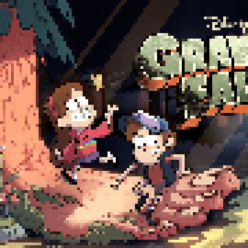

# cscale0.1x - Extreme Contour Downscaler

Contour-preserving adaptive downscaling for artwork, cartoons, pixel art, [wplace](https://wplace.live) image scaling, etc.

[ area -> cscale0.1x" width="500px"/>](pic/)

**Key features**

+ Tailored to extreme shrinkage (0.4x and smaller)
+ Ideal for line art downscaling and pixel art generation
+ Preserves details smaller than 1 downscaled pixel
+ Fast vectorized implementation using `numpy` and `scikit`
+ Automatic contour extraction, eliminates double and fake edges
+ Great results out of the box
+ Extensive configuration options
+ Comprehensible usage manual

Loosely based on [adaptive pixel art scaler](https://hiivelabs.com/blog/gamedev/graphics/2025/01/19/adaptive-downscaling-pixel-art/).

| cscale0.1x  | adaptive downscaling  |
| ----------- | --------------------- |
| Aggressive downscaling of high quality artwork | Pixel art downscaling |
| Uses clean contours | Uses raw edges from Canny edge detector |
| Performs all preprocessing in the original image | Processes already downscaled image |
| Fast optimized code | Slow Python loops |

See [examples](examples/) for cscale0.1x capabilities demonstration.

## Installation

To install Python head over to [www.python.org](https://www.python.org/downloads/).

*Notice. The program is tested for Python 3.13, but will probably work with later Python versions.*

Create a virtual environment and install packages:

```
python -m venv venv
source venv/bin/activate[.fish,.zsh]
pip install -r requirements.txt
```

## Usage

The program can be used like this:

`python main.py -s SCALE_FACTOR filename`

See the full usage manual by running:

`python main.py -h`
